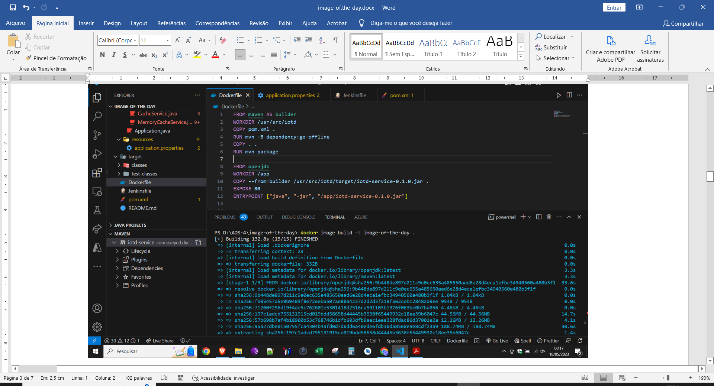
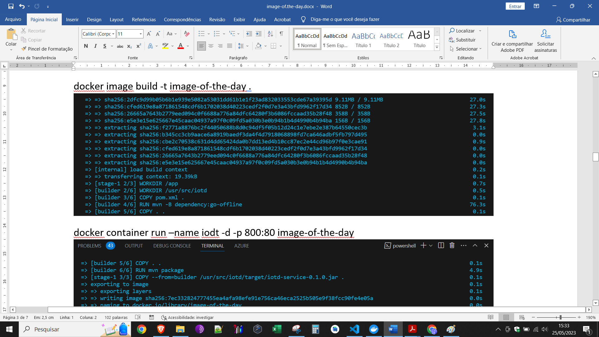
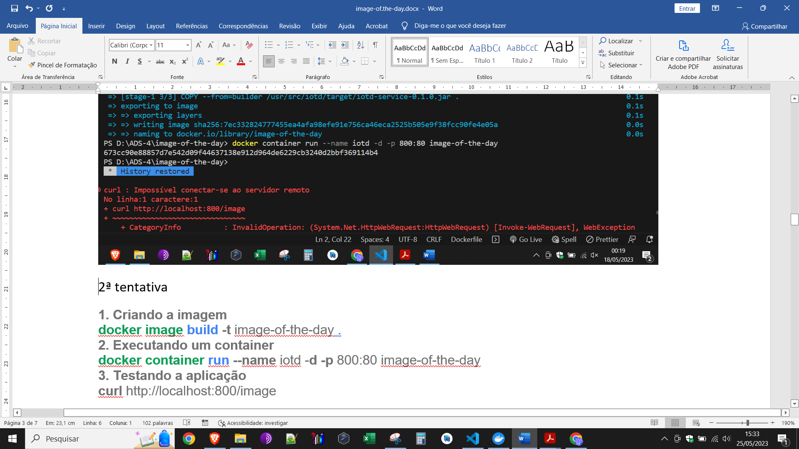
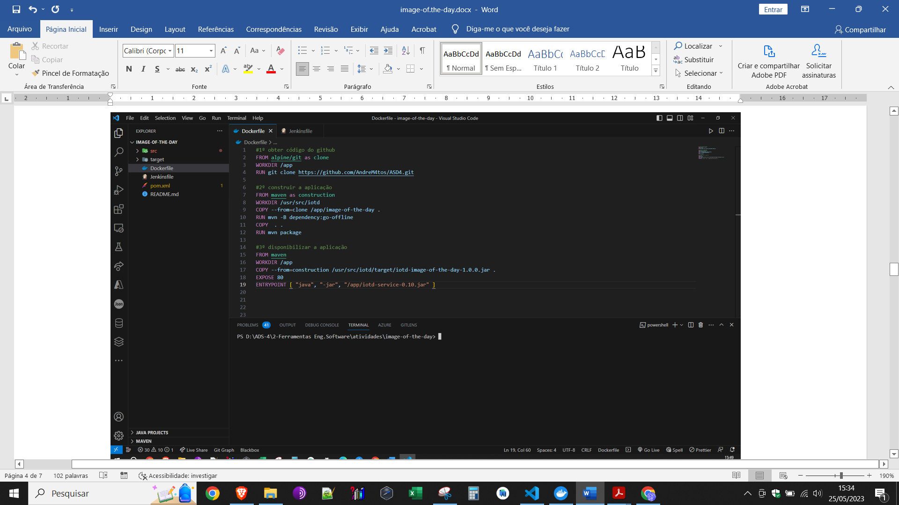
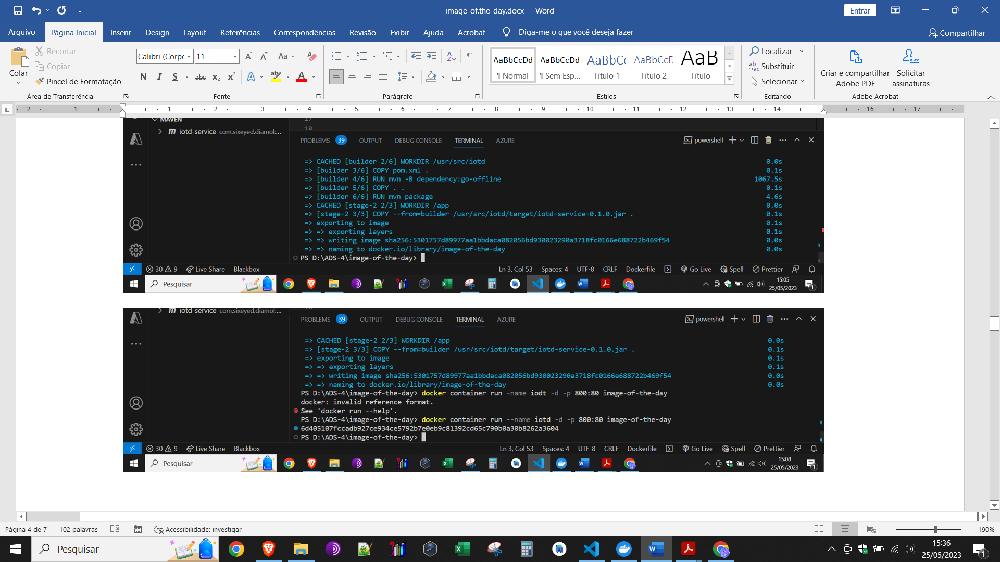
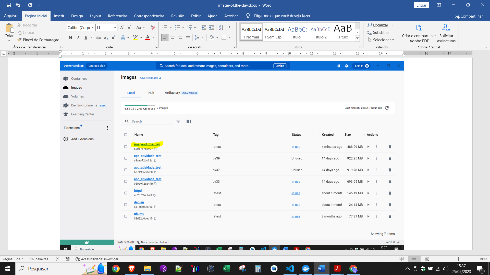
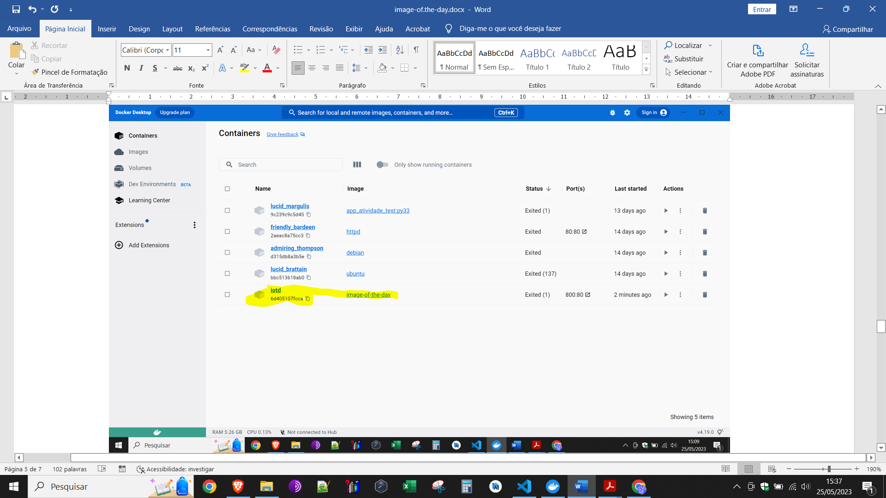
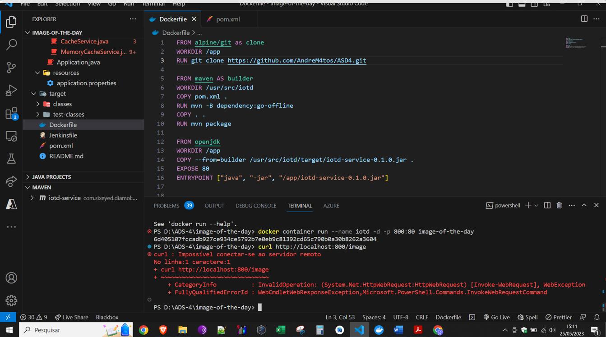
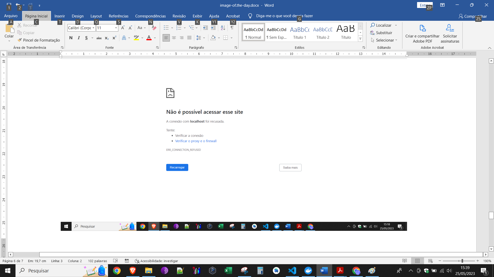

#ALUNOS: Andre Matos, Roger, Jessé e Gabriel

docker image build -t image-of-the-day
##docker container run –name iodt -d -p 800:80 image-of-the-day
2ª tentativa
1. Criando a imagem docker image build -t image-of-the-day .
2. 2. Executando um container
docker container run --name iotd -d -p 800:80 image-of-the-day
1. Testando a aplicação curl http://localhost:800/image    Professor Roussian após várias tentativas desse (#¨%#$#$@$¨%$%¨$$@%$*¨%¨¨%(()!””@#$#$) não conseguimos acesso ás imagens. Tentamos várias e várias vezes tivemos muita dificuldade, mas na parte de criarmos a image foi OK, o container foi OK conforme demonstrado nas figuras. Precisamos de ajuda para entender como visualizar o localhost que foi um desastreeeee... Por fim, tentamos concluír a tarefa. 

